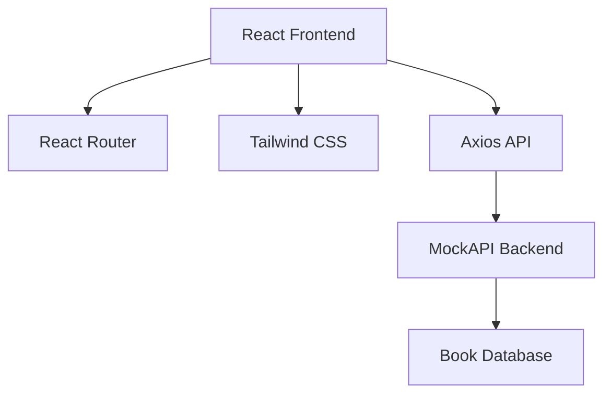
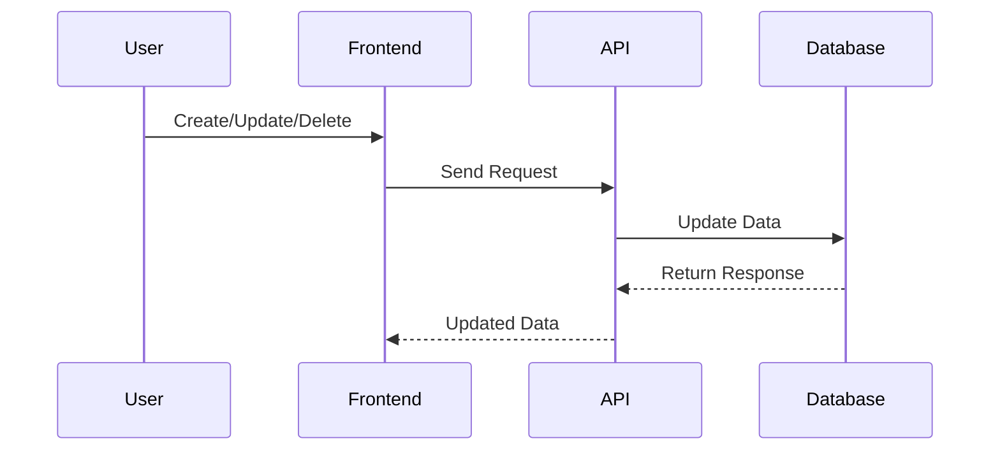
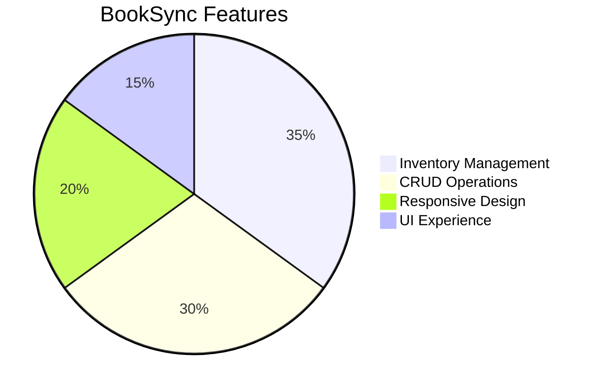

<div align="center">


# 📚 BookSync

### Smart • Fast • Modern • Book Inventory Manager

<p align="center">


</p>

<p align="center">
  
  
  
  
</p>

<p align="center">
  
  
  
</p>

</div>

---

# ✨ About BookSync

BookSync is a modern **Book Inventory Management System** built for managing book collections digitally.

It provides:

📚 Inventory tracking  
➕ Add new books  
✏ Edit records  
❌ Delete entries  
📖 Detailed book information  
⚡ Real-time syncing  

A simple and powerful system with clean UI and fast performance.

---

# 🌟 Features

<div align="center">

| 🚀 Feature | 📌 Description |
|------------|----------------|
| 📚 Inventory Dashboard | View all books in one place |
| ➕ Add Books | Create new records |
| ✏ Edit Records | Update book data |
| ❌ Delete Books | Remove unwanted books |
| 📖 Book Details | Full description & publisher info |
| 🌐 API Sync | Real-time data updates |
| 📱 Responsive Design | Mobile + Desktop optimized |
| ✨ Smooth UI | Modern transitions & animations |

</div>

---

# 🏗 Architecture



---

# ⚡ Application Flow


---

# 📊 CRUD Workflow



---

# 🛠 Tech Stack

<div align="center">

| Technology | Purpose |
|------------|---------|
| React | Frontend UI |
| Tailwind CSS | Styling |
| React Router | Navigation |
| Axios | API Communication |
| MockAPI | Backend |

</div>

---

# 📂 Project Structure

```bash
BookSync/
│── src/
│   ├── components/
│   ├── pages/
│   ├── services/
│   ├── routes/
│   ├── App.jsx
│   └── main.jsx
│
│── public/
│── package.json
│── README.md
```

---

# 📌 Application Pages

<div align="center">

| Page | Description |
|------|-------------|
| 📊 Dashboard | Main inventory page |
| ➕ Add Book | Add new book entries |
| ✏ Edit Book | Modify existing data |
| 📖 Book Details | View complete details |

</div>

---

# 🚀 Installation

## Clone Repository

```bash
git clone https://github.com/viveklanke007/Book_inventory_manager.git
```

---

## Navigate to Project

```bash
cd Book_inventory_manager
```

---

## Install Dependencies

```bash
npm install
```

---

## Start Development Server

```bash
npm run dev
```

---

## Open Browser

```bash
http://localhost:5173
```

---

# 🌐 API Endpoint

```bash
https://69722c3332c6bacb12c60916.mockapi.io/api/books/
```

---

# 🔄 CRUD API Routes

```bash
GET /books
POST /books
PUT /books/:id
DELETE /books/:id
```

---

# 📈 Project Stats



---

# 🔥 Why BookSync?

✅ Clean UI  
✅ Easy CRUD Operations  
✅ Responsive Design  
✅ API Integration  
✅ Fast Performance  
✅ Simple Architecture  
✅ Easy Maintenance  

---

# 🤝 Contribution Guide

```bash
Fork → Clone → Create Branch → Code → Commit → Push → Pull Request
```

## Create Feature Branch

```bash
git checkout -b feature-name
```

## Commit Changes

```bash
git commit -m "Added feature"
```

## Push Changes

```bash
git push origin feature-name
```

---

# 👨‍💻 Author

## Vivek Lanke

GitHub:  
https://github.com/viveklanke007

---

<div align="center">


## ⭐ Star this repository if you found it useful

Built with ❤️ using React + Tailwind CSS

</div>
