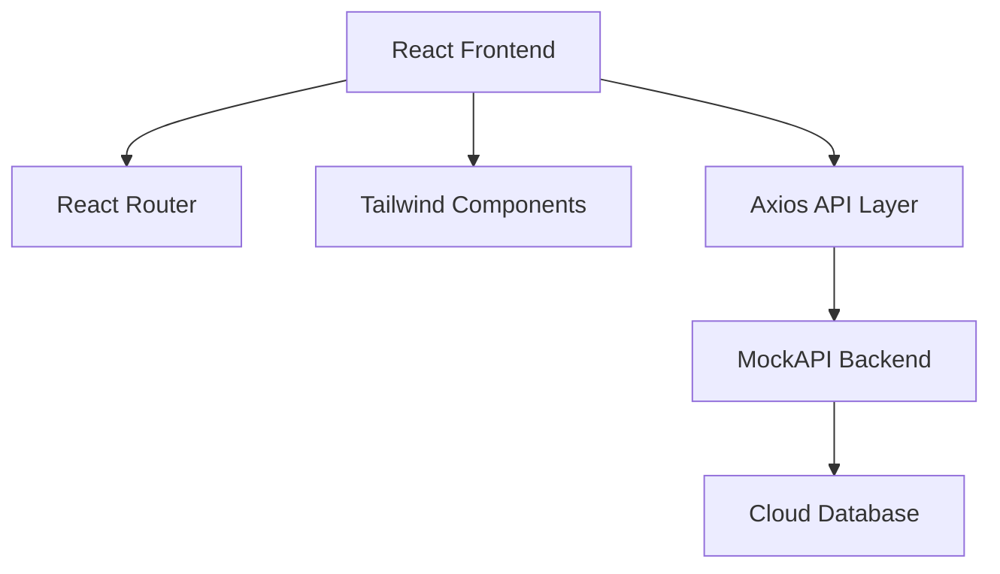
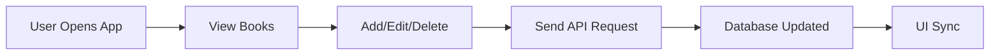
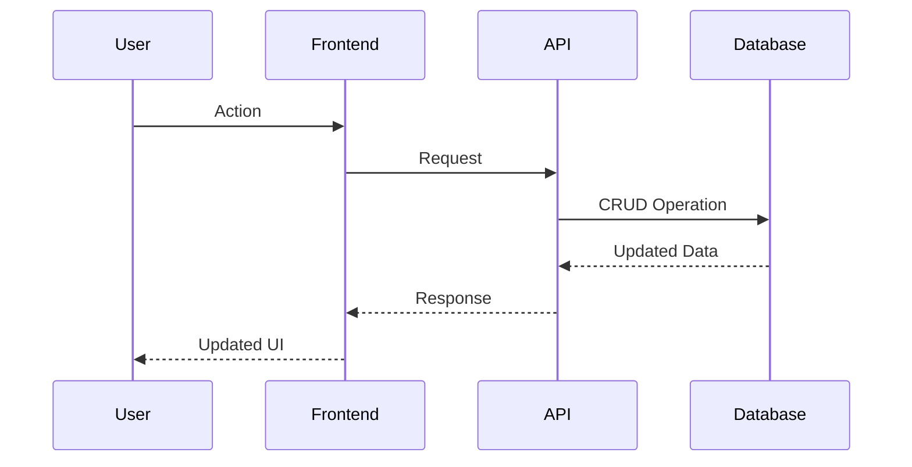

<div align="center">


# 📚 BookSync

### ✨ Smart Library Management • Fast Inventory Tracking • Beautiful UI

<p align="center">


</p>

<p align="center">
  
  
  
</p>

<p align="center">
  
  
  
  
</p>

### 🚀 The Ultimate Book Inventory Experience


---

</div>

# 🌟 Overview

BookSync is a **modern digital book inventory platform** designed for seamless book management.

It gives users complete control over their library system.

✨ Add Books  
✨ Edit Books  
✨ Delete Books  
✨ Track Details  
✨ View Full Descriptions  
✨ Manage Publishers  

---

<div align="center">

## ⚡ Live Experience


</div>

---

# 🎯 Core Features

<div align="center">

| 🚀 Feature | 🎯 Description |
|------------|----------------|
| 📚 Inventory Dashboard | View all books in a clean table |
| ➕ Add New Books | Register books instantly |
| ✏ Update Records | Edit existing data |
| ❌ Remove Books | Delete unwanted books |
| 🔍 Book Details | Full detailed information |
| 🌐 API Sync | Real-time backend synchronization |
| 📱 Responsive UI | Works on every screen |
| ✨ Animations | Smooth transitions & effects |

</div>

---

# 🎬 Animated Preview

## 📊 Dashboard Experience


---

## ➕ Add Book Animation


---

## ✏ Edit Book Flow


---

## 📖 Detailed View Animation


---

# 🏗 Architecture



---

# ⚡ Workflow



---

# 📊 Data Flow



---

# 🛠 Tech Stack

<div align="center">

| Frontend | Backend | Styling |
|----------|---------|---------|
| React | MockAPI | Tailwind CSS |
| Axios | REST API | Responsive Design |
| React Router | Cloud Storage | Animations |

</div>

---

# 📂 Project Structure

```bash
BookSync/
│── src/
│   ├── components/
│   ├── pages/
│   ├── routes/
│   ├── services/
│   ├── App.jsx
│   └── main.jsx
│
│── public/
│   ├── banner.gif
│   ├── dashboard.gif
│   ├── add-book.gif
│   ├── edit-book.gif
│   ├── book-details.gif
│
│── package.json
│── README.md
```

---

# 📌 Pages

<div align="center">

| Page | Description |
|------|-------------|
| 📊 Dashboard | Main inventory screen |
| ➕ Add Book | Create new entries |
| ✏ Edit Book | Modify book records |
| 📖 Book Details | Full information page |

</div>

---

# 🚀 Installation

## Clone Repository

```bash
git clone https://github.com/viveklanke007/Book_inventory_manager.git
```

---

## Enter Project Folder

```bash
cd Book_inventory_manager
```

---

## Install Dependencies

```bash
npm install
```

---

## Start Development Server

```bash
npm run dev
```

---

## Open Browser

```bash
http://localhost:5173
```

---

# 🌐 API Endpoint

```bash
https://69722c3332c6bacb12c60916.mockapi.io/api/books/
```

---

# 🔄 CRUD Routes

```bash
GET /books
POST /books
PUT /books/:id
DELETE /books/:id
```


# 🔥 Why BookSync?

<div align="center">

⚡ Fast Performance  
🎨 Beautiful UI  
📱 Mobile Responsive  
🔄 Real-time Sync  
🧩 Modular Code  
🚀 Easy Deployment  
📚 Perfect for Library Management  

</div>

---

# 🤝 Contribution Guide

```bash
Fork → Clone → Create Branch → Code → Commit → Push → PR
```

## Create Branch

```bash
git checkout -b feature-name
```

## Commit Changes

```bash
git commit -m "Added new feature"
```

## Push Branch

```bash
git push origin feature-name
```

---

# 👨‍💻 Author

<div align="center">

## Vivek Lanke

🚀 Full Stack Developer

GitHub:  
https://github.com/viveklanke007

</div>

---

<div align="center">


## ⭐ Star this repository if you found it useful

### Made with ❤️ using React + Tailwind CSS

</div>
